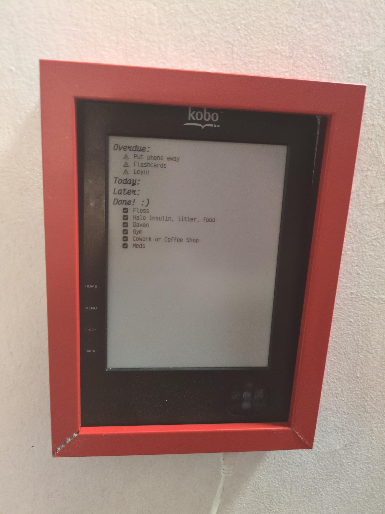

# The World Needs a Networked TODO App Running On 2011 Embedded EInk

And I'm here to provide.

Full writeup [here](https://www.jamesgisele.com/blog/embedded_todo/)!

# What is this?

Highly idiosyncratic script I wrote to 
- naiively parse my emacs [org-mode](https://orgmode.org/) [todos](https://orgmode.org/manual/TODO-Items.html) and [habits](https://orgmode.org/manual/Tracking-your-habits.html) into a raw image file,
- copy that file over to a 2011 Kobo ereader via netcat,
- and call the Kobo's built in rendering executable (which expects a file at a certain location) to render that image to the Kobo screen.

I've got a [WebDAV](https://en.wikipedia.org/wiki/WebDAV) file server running on my home server, which is exposed to all my devices via [Tailscale](https://tailscale.com/docs/features/taildrive). My emacs org-mode todos and habits live in files on that server, meaning I can edit them from anywhere within my tailnet. (Think of it as a poor man's Dropbox or Google Drive). On that home server, I've got a [systemd](https://wiki.archlinux.org/title/Systemd) service hooked up to monitor any changes to those .org files. When I edit those files to eg mark a todo done, either on my desktop computer within emacs or via my phone with [Orgzly (Revived)](https://www.orgzlyrevived.com/), the systemd services sees that happen and calls the rust program contained in this repo, and my ereader updates its display with the new state of my todos. 

# Literally, why?
I like todos. (Really.) I hate my phone. I wanted my todos and daily habits to be visible without looking at an LED screen, seeing my email notifications or texts, etc.

This Kobo ereader is really no longer suitable for use as an actual ereader due to its battery being pretty shot, its buttons being broken (no touch screen), and its rendering capacity being painfully slow. I'm enjoying giving it a second life as a "good excuse to improve my understanding of embedded devices/reverse engineering/hacking skills" and it's a pretty ideal medium for that. They literally shipped the thing with a basic linux installation and an unlocked root account. Three cheers for "ship now secure later!"

Ideally, I'd like to update them via the ereader too, maybe get emacs running on the device itself eventually. . . but since the ereader I've got and am essentially using as a monitor is from 2011 and lacks a robust input system (no touch screen, its current buttons are broken), that may have to wait until I upgrade my hardware ever so slightly to a model with a touch screen. 

